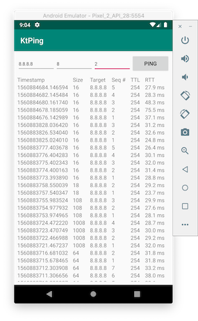

# Ping for Android in Kotlin

WORK IN PROGRESS

## Description
This is a demonstration of an ICMP ping application for Android with configurable size and interval. The application executes a system ping process with defined paramteres and uses a simple regex to parse values. Some very basic exceptions handling is implemented.

The figure below shows a screenshot of a simulated run.

## Authorship and license
Igor Kim

The repository is distributed under [MIT license](LICENSE.MD).
